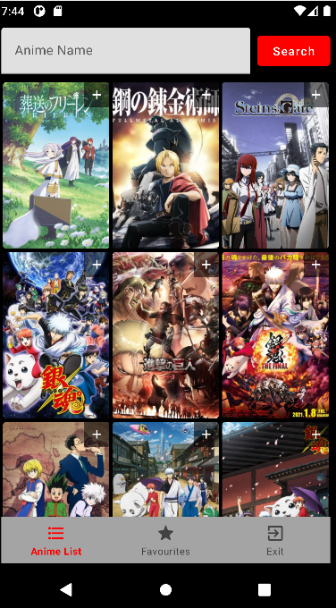
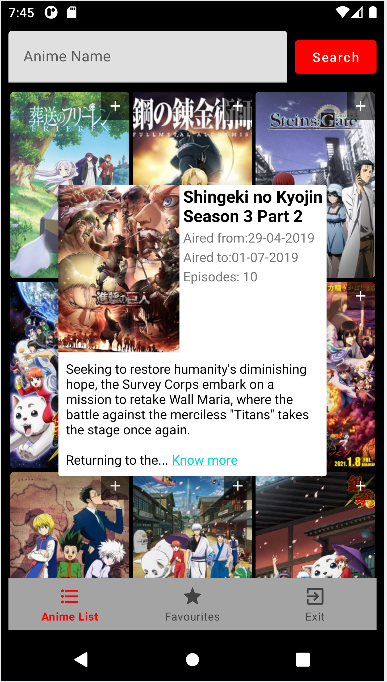
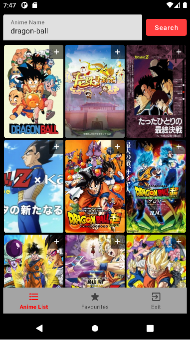
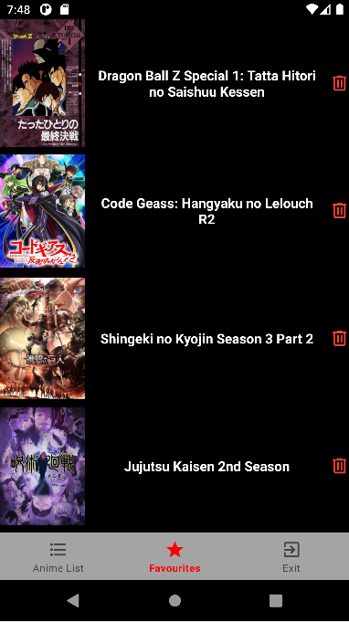
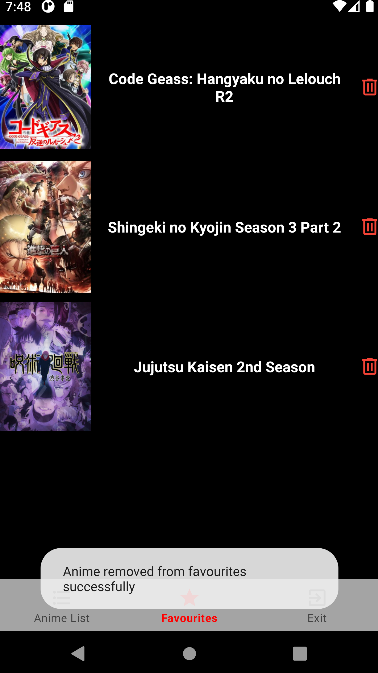
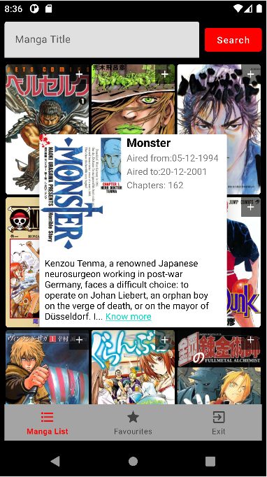
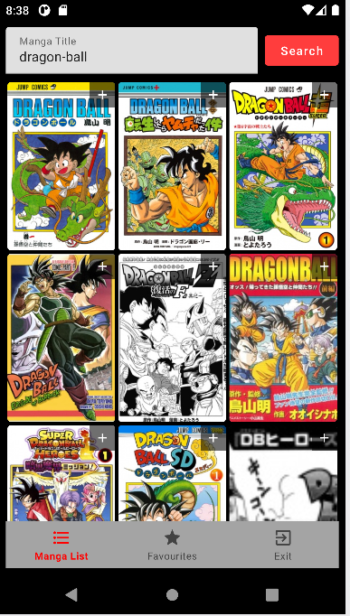
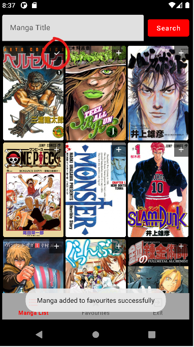
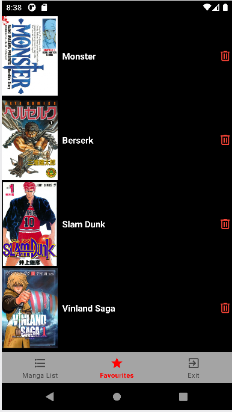
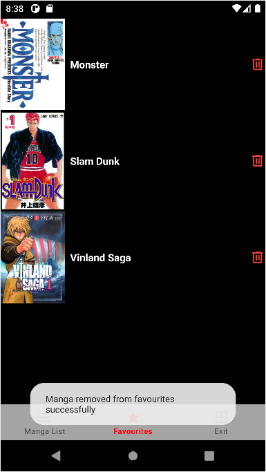

<!-- PROJECT LOGO -->
 

  
<h3 align="center">Subarashi-JPOP</h3>

  Are you a fan of the amazing Japanese pop culture? Do you want to have the toppest anime and manga on the palm of your hand? Welcome to Subarashi-JPOP, the android application that gives you all the information about your anime and manga and will help you manage the favorite list.
   
  <a href="https://github.com/Marawan89/Subarashi_JPOP"><strong>Repository: »</strong></a>
   
   
  ·
  ·

<!-- TABLE OF CONTENTS -->

  
Index:

  <ol>
    <li>
      <a href="#about-the-project">The Project</a>
    </li>
    <li>
      <a href="#getting-started">Getting Started</a>
    </li>
    <li><a href="#roadmap">Roadmap</a></li>
  </ol>

<!-- ABOUT THE PROJECT -->

## The Project

  As said before in this project you can view the list of the top anime and manga, this list gets update using the MyAnimeList rating so it's pretty accurate. You can add your favourite anime and manga by clicking the + botton and view your favourite list in the favourite page.

The technologies used in this project are LiveData, RecyclerView, ViewModel, Repositories, RoomDatabase, Dao, Entities and dialogs

<!-- GETTING STARTED -->

## Getting Started
If this is your first time installing the application you will need to connect to internet or you will not view anything (the list of the anime/manga needs internet but the favourite list can be viewed offline).After that you will select the category you want (AnimeWorld or MangaWorld)  

<!-- ... (rest of your "Getting Started" section) -->

### Anime

If you choose anime this is what you will display

In this activity with the help of recyclerview and pagination we have the possibility to scroll through the cores and view a lot of them

Wait but what if i need some information of the anime? The poster is cool but i wanna know how much episodes does it have. Just click on the image

A little window will open with the number of episodes, the aired from and aired to date, a synopsis and the a link with the official page of the anime in the MyAnimeList site.

You can also search for your favorite anime in the search bar

Do you like an anime a lot? Or do you want to save it so you can watch it later? With the + button you have the option of adding an anime to your list of favorites.

To view the favourite anime list click on the favourites botton on the nav bar

Here you can add anime as much as you want. An anime is too old? You don't like it anymore? Click on the bin icon and get rid of it

## Manga

If you chose manga this is what you will display

In this activity with the help of recyclerview and pagination we have the possibility to scroll through the cores and view a lot of them

Wait but what if I need some information of the manga? The poster is cool but I wanna know how many chapters does it have. Just click on the image

A little window will open with the number of chapters, the serialized from and serialized to date, a synopsis, and a link with the official page of the manga on the MyAnimeList site.

You can also search for your favorite manga in the search bar

Do you like a manga a lot? Or do you want to save it so you can read it later? With the + button, you have the option of adding a manga to your list of favorites.

To view the favourite manga list click on the favorites button on the nav bar

Here you can add manga as much as you want. A manga is too old? You don't like it anymore? Click on the bin icon and get rid of it

<!-- ROADMAP -->

## Roadmap
Mandatory features:
- [x] Project structure (separations of concerns)
- [x] Logic behind every activity
- [x] Managing api calls (remote, model)
- [x] LiveData, ViewModels and Adapters
- [x] Repositories
- [x] RoomDatabase implementation (daos, entities)
- [x] Background thread Implementation

Optional features:
- [x] Details dialog
- [x] Add icon that turns into check icon
- [x] Toast messages
