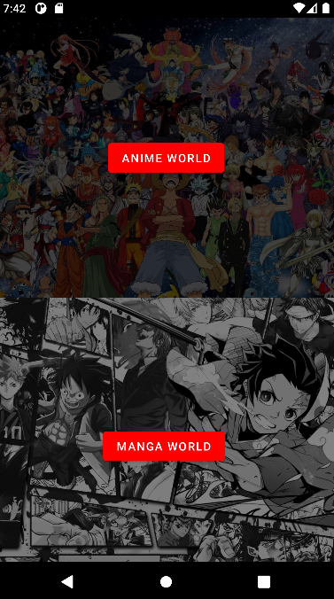
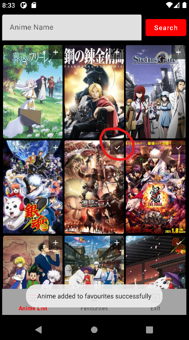
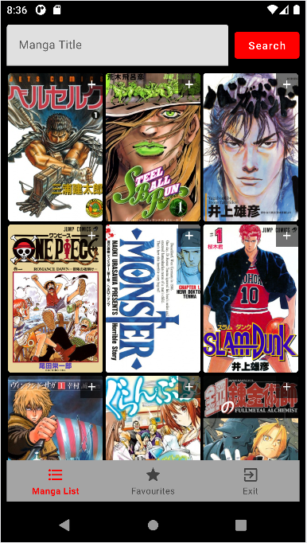

 <a name="readme-top"></a>

<!-- PROJECT LOGO -->
<br />
<div align="center">
  <a href="https://github.com/Marawan89/Subarashi_JPOP">
    
  </a>
<h3 align="center">Subarashi-JPOP</h3>

<p align="center">
  Are you a fan of the amazing Japanese pop culture? Do you want to have the toppest anime and manga on the palm of your hand? Welcome to Subarashi-JPOP, the android application that gives you all the information about your anime and manga and will help you manage the favorite list.
  <br />
  <a href="https://github.com/Marawan89/Subarashi_JPOP"><strong>Repository: »</strong></a>
  <br />
  <br />
  ·
  ·
</p>
</div>

<!-- TABLE OF CONTENTS -->
<details>
  <summary>Index:</summary>
  <ol>
    <li>
      <a href="#about-the-project">The Project</a>
    </li>
    <li>
      <a href="#getting-started">Getting Started</a>
    </li>
    <li><a href="#roadmap">Roadmap</a></li>
      <li>
        <a href="#technologies">Technologies adopted</li>
      <li>
        <a href="#APK">APK Download
      </li>
  </ol>
</details>

<!-- ABOUT THE PROJECT -->
<a name="about-the-project"></a>
## Project goal
<p>
  As said before in this project you can view the list of the top anime and manga, this list gets update using the MyAnimeList API so it's pretty accurate. You can add your favourite anime and manga by clicking the + botton and view your favourite list in the favourite page.
</p>


<!-- What technologies have helped me get to my goal -->
<a name="technologies"></a>
## Technologies adopted
<p>The technologies used in this project are LiveData, RecyclerView, ViewModel, Repositories, RoomDatabase, Dao, Entities, LifecycleOwner and dialogs</p>
<p><strong>* = anime/manga</strong></p>

### LiveData
The ViewModel `*ListViewModel` uses LiveData to dynamically manage data related to the list of *. Here is how this management is implemented:

```
private var _*ListLiveData = MutableLiveData<List<*Model>>()
private var _*FavouriteLiveData = MutableLiveData<List<*Entity>>()
```
The variables `_*ListLiveData` e `_*FavouriteLiveData` are LiveData that contain the list of * and the list of * favorites, respectively.

`_*ListLiveData` is used by the `*Model` to display the list of the top * while `_*FavouriteLiveData` uses the `*Entity` to view the favourite list 

### RecyclerView / ViewModel
The `RecyclerView` in the `*ListActivity` is a critical component responsible for displaying the list of * items. This is how it is configured and how it interacts with the `*ListAdapter`:

The `RecyclerView` is configured with a `GridLayoutManager` to organize the * items in a grid layout with three columns. This provides a visually appealing and organized presentation of the * list.

```
recyclerView = findViewById(R.id.recyclerView)
recyclerView.layoutManager = GridLayoutManager(this, 3)
recyclerView.adapter = adapter
```
#### Pagination
To enhance the user experience and allow for seamless browsing of the * list, a pagination mechanism is implemented. When the user scrolls to the end of the list, the *ListViewModel's loadMore * method is triggered to fetch additional * items from the repository.

```
recyclerView.addOnScrollListener(object : RecyclerView.OnScrollListener() {
    override fun onScrolled(recyclerView: RecyclerView, dx: Int, dy: Int) {
        super.onScrolled(recyclerView, dx, dy)

        val layoutManager = recyclerView.layoutManager as GridLayoutManager
        val totalItemCount = layoutManager.itemCount
        val lastVisible* = layoutManager.findLastVisibleItemPosition()

        if (totalItemCount <= lastVisible* + 2) {
            *ListViewModel.loadMore*()
        }
    }
})
```

#### Data Observation
The *ListAdapter observes changes in the *List LiveData from the associated *ListViewModel. Whenever the underlying data changes, the adapter is notified, and the setData method is called to update the displayed * list.

```
*ListViewModel.*List.observe(this, Observer { * ->
    adapter.setData(*)
})
```
This combination of configuration, pagination, and LiveData observation ensures that the * list is dynamically updated and provides a smooth and engaging user experience in navigating through the diverse world of *.

### LifecycleOwner 

<p>The LifecycleOwner is a crucial component in Android development, especially when dealing with architectural components like ViewModels. In your *ListActivity, the *LifecycleOwner plays a significant role in managing the lifecycle of the associated ViewModel</p>

#### Purpose
The *LifecycleOwner is initialized with the current activity (this), which implements the LifecycleOwner interface. This association allows the ViewModel (*ListViewModel) to observe LiveData changes and perform actions (+ icon or 🗸 icon) based on the lifecycle state of the activity.


<!-- GETTING STARTED -->
<a name="getting-started"></a>

### Repository / RemoteService API / RoomFavouriteLocalService

The `*Repository` acts as a bridge between the remote *Service API and the local RoomFavouriteLocalService database. Its primary purpose is to manage data retrieval and storage for *-related information.

The repository incorporates exception handling to deal with potential issues, such as HTTP exceptions during API calls. Logs are generated to provide insight into the nature of encountered errors.

By encapsulating these operations within the repository, the rest of the application can interact with a unified interface, making it easier to manage and update data between the remote API and the local database seamlessly.


## Getting Started
If this is your first time installing the application you will need to connect to internet or you will not view anything (the list of the anime/manga needs internet but the favourite list can be viewed offline).After that you will select the category you want (AnimeWorld or MangaWorld) <br />


<!-- ... (rest of your "Getting Started" section) -->

### Anime
<p>If you choose anime this is what you will display</p>

<p>In this activity with the help of recyclerview and pagination we have the possibility to scroll through the cores and view a lot of them</p>

<p>Wait but what if i need some information of the anime? The poster is cool but i wanna know how much episodes does it have. Just click on the image</p>

<p>A little window will open with the number of episodes, the aired from and aired to date, a synopsis and the a link with the official page of the anime in the MyAnimeList site.</p>

<p>You can also search for your favorite anime in the search bar</p>


<p>Do you like an anime a lot? Or do you want to save it so you can watch it later? With the + button you have the option of adding an anime to your list of favorites.</p>


<p>To view the favourite anime list click on the favourites botton on the nav bar</p>


<p>Here you can add anime as much as you want. An anime is too old? You don't like it anymore? Click on the bin icon and get rid of it</p>


## Manga
<p>If you chose manga this is what you will display</p>

<p>In this activity with the help of recyclerview and pagination we have the possibility to scroll through the cores and view a lot of them</p>

<p>Wait but what if I need some information of the manga? The poster is cool but I wanna know how many chapters does it have. Just click on the image</p>

<p>A little window will open with the number of chapters, the serialized from and serialized to date, a synopsis, and a link with the official page of the manga on the MyAnimeList site.</p>

<p>You can also search for your favorite manga in the search bar</p>


<p>Do you like a manga a lot? Or do you want to save it so you can read it later? With the + button, you have the option of adding a manga to your list of favorites.</p>


<p>To view the favourite manga list click on the favorites button on the nav bar</p>


<p>Here you can add manga as much as you want. A manga is too old? You don't like it anymore? Click on the bin icon and get rid of it</p>


<!-- ROADMAP -->
<a name="roadmap"></a>
## Roadmap
Mandatory features:
- [x] Project structure (separations of concerns)
- [x] Logic behind every activity
- [x] Managing api calls (remote, model)
- [x] LiveData, ViewModels and Adapters
- [x] Repositories
- [x] RoomDatabase implementation (daos, entities)
- [x] Background thread Implementation

Optional features:
- [x] Details dialog
- [x] + icon that turns into 🗸 icon
- [x] Toast messages
      
Possible Future Improvements:
- [ ] Deatils dialog in the Favourite list
- [ ] Ability to keep track of seasons/episodes/chapters/volumes
- [ ] Ability to watch episodes in streaming
- [ ] Ability to read manga in Scan


<a name="APK"></a>
So what are you waiting for [Download the apk](app-debug.apk).
